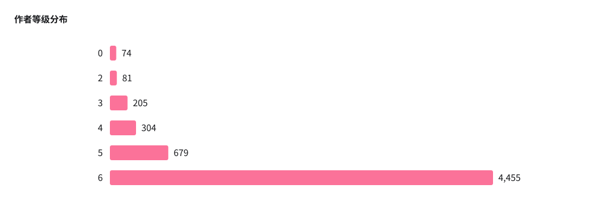
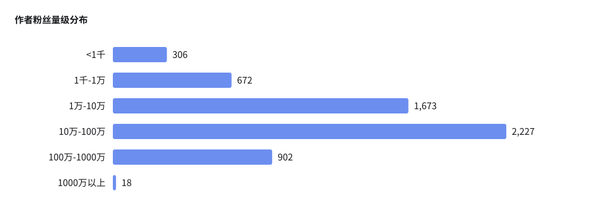
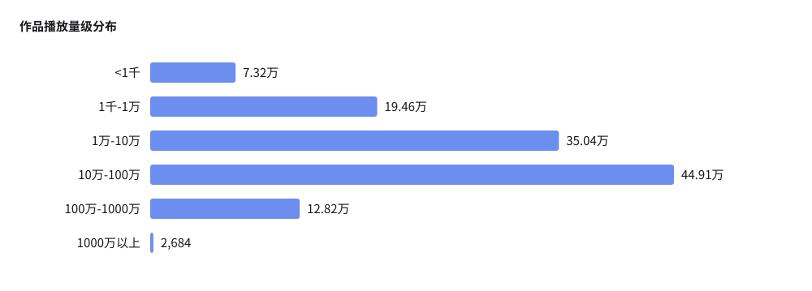
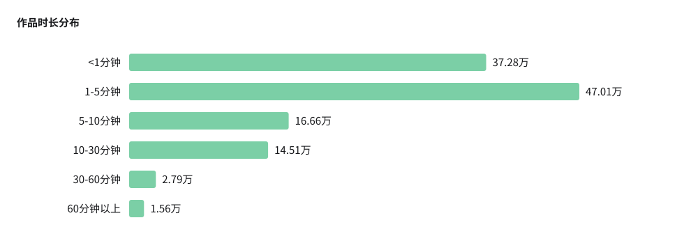
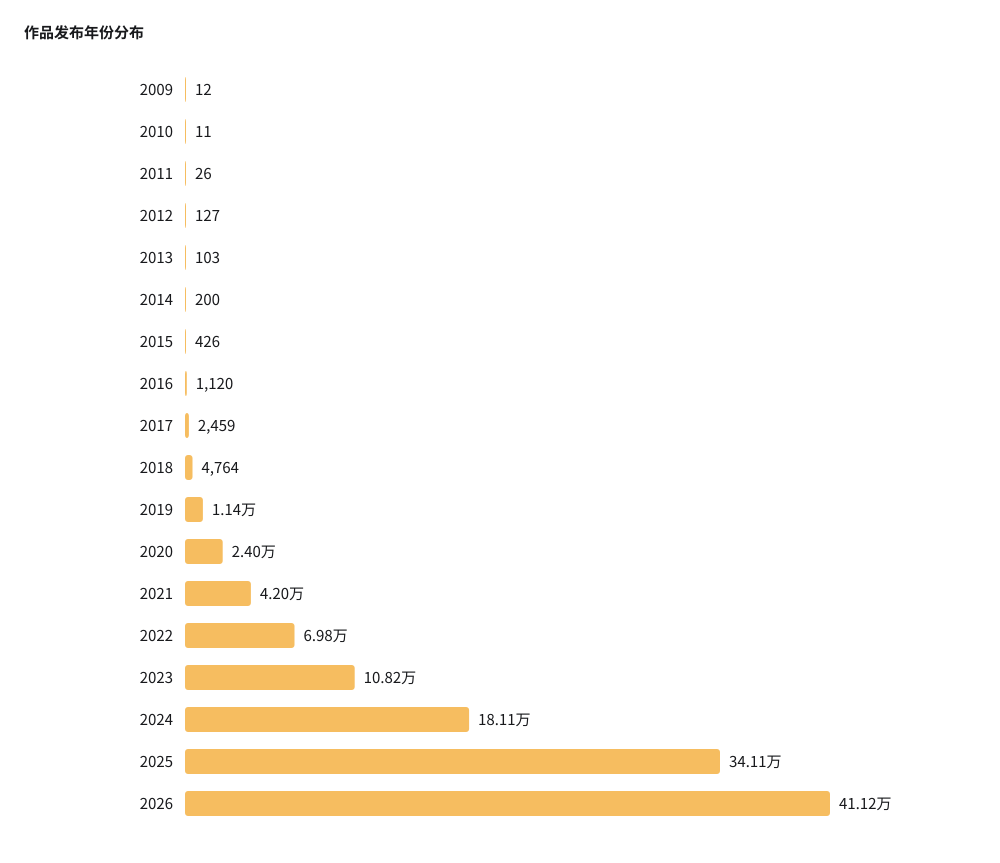
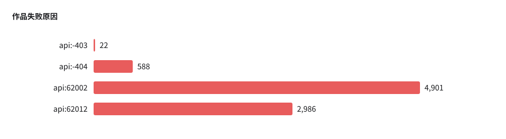
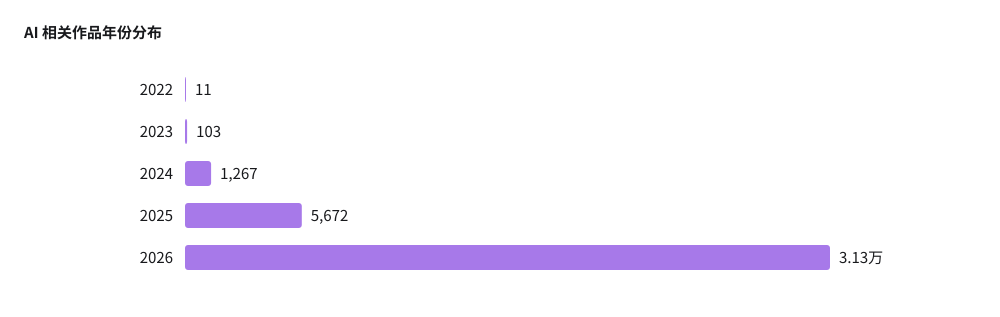

# Bilibili 作者与作品数据分析报告

> 统计范围：全部年份作品；统计生成时间：2026-09-10T11:34:41Z。
> 排行榜头像和封面直接引用在线地址，离线阅读时可能无法显示。

## 1. 核心概况

| 指标 | 数值 |
| --- | ---: |
| 入选作者 | 5,798 |
| 作者资料可用率 | 100.00% |
| 认证作者 | 2,364 |
| 作品记录 | 120.66万 |
| 唯一 BV 号 | 119.87万 |
| 作品抓取成功率 | 99.30% |
| 参与联合投稿作者 | 2,439 |
| 参与联合投稿作者占比 | 42.07% |
| 联合投稿作品（唯一 BV） | 3.86万 |
| AI 相关作品 | 3.84万 |
| AI 相关作品占比 | 3.20% |
| 涉及 AI 作品的作者 | 1,854 |

## 2. 作者分析

### 作者指标

| 指标 | 有效数 | 缺失 | 最小值 | 最大值 | 平均值 | 标准差 |
| --- | ---: | ---: | ---: | ---: | ---: | ---: |
| 粉丝数 | 5,798 | 0 | 10 | 3217.51万 | 56.36万 | 134.74万 |
| 作者累计获赞 | 5,798 | 0 | 1,439 | 4.93亿 | 647.48万 | 1508.11万 |
| 账号投稿总数 | 5,798 | 0 | 0 | 14.73万 | 516.49 | 2,855.45 |
| 专栏总数 | 5,798 | 0 | 0 | 0 | 0 | 0 |
| 入选作品数 | 5,798 | 0 | 1 | 400 | 208.11 | 149.64 |

### 粉丝数排行榜

| 排名 | 头像 | 作者 | UID | 粉丝数 |
| ---: | --- | --- | --- | ---: |
| 1 |  | [罗翔说刑法](https://space.bilibili.com/517327498) | 517327498 | 3217.51万 |
| 2 |  | [一数](https://space.bilibili.com/14229967) | 14229967 | 2597.18万 |
| 3 |  | [央视新闻](https://space.bilibili.com/456664753) | 456664753 | 2450.65万 |
| 4 |  | [原神](https://space.bilibili.com/401742377) | 401742377 | 2078.13万 |
| 5 |  | [老番茄](https://space.bilibili.com/546195) | 546195 | 2076.68万 |
| 6 |  | [影视飓风](https://space.bilibili.com/946974) | 946974 | 1737.38万 |
| 7 |  | [哔哩哔哩英雄联盟赛事](https://space.bilibili.com/50329118) | 50329118 | 1683.64万 |
| 8 |  | [帕梅拉PamelaReif](https://space.bilibili.com/604003146) | 604003146 | 1498.79万 |
| 9 |  | [鲤鱼Ace](https://space.bilibili.com/15634833) | 15634833 | 1249.58万 |
| 10 |  | [崩坏星穹铁道](https://space.bilibili.com/1340190821) | 1340190821 | 1248.82万 |
| 11 |  | [绵羊料理](https://space.bilibili.com/18202105) | 18202105 | 1214.06万 |
| 12 |  | [王者荣耀](https://space.bilibili.com/57863910) | 57863910 | 1185.03万 |
| 13 |  | [小约翰可汗](https://space.bilibili.com/23947287) | 23947287 | 1087.95万 |
| 14 |  | [中国BOY超级大猩猩](https://space.bilibili.com/562197) | 562197 | 1076.24万 |
| 15 |  | [无穷小亮的科普日常](https://space.bilibili.com/14804670) | 14804670 | 1070.38万 |
| 16 |  | [宋浩老师官方](https://space.bilibili.com/66607740) | 66607740 | 1050.39万 |
| 17 |  | [你的影月月](https://space.bilibili.com/431073645) | 431073645 | 1047.59万 |
| 18 |  | [一化儿](https://space.bilibili.com/1526560679) | 1526560679 | 1019.75万 |
| 19 |  | [食贫道](https://space.bilibili.com/39627524) | 39627524 | 963.28万 |
| 20 |  | [TF家族](https://space.bilibili.com/3670216) | 3670216 | 955.04万 |

### 累计获赞排行榜

| 排名 | 头像 | 作者 | UID | 累计获赞 |
| ---: | --- | --- | --- | ---: |
| 1 |  | [央视新闻](https://space.bilibili.com/456664753) | 456664753 | 4.93亿 |
| 2 |  | [原神](https://space.bilibili.com/401742377) | 401742377 | 2.83亿 |
| 3 |  | [老番茄](https://space.bilibili.com/546195) | 546195 | 1.94亿 |
| 4 |  | [伤心欲茄222](https://space.bilibili.com/3493260618106936) | 3493260618106936 | 1.85亿 |
| 5 |  | [TF家族](https://space.bilibili.com/3670216) | 3670216 | 1.70亿 |
| 6 |  | [明日方舟](https://space.bilibili.com/161775300) | 161775300 | 1.62亿 |
| 7 |  | [波士顿圆脸](https://space.bilibili.com/346563107) | 346563107 | 1.59亿 |
| 8 |  | [崩坏星穹铁道](https://space.bilibili.com/1340190821) | 1340190821 | 1.56亿 |
| 9 |  | [star星视频](https://space.bilibili.com/1685024055) | 1685024055 | 1.55亿 |
| 10 |  | [籽岷](https://space.bilibili.com/686127) | 686127 | 1.53亿 |
| 11 |  | [红星视频](https://space.bilibili.com/526890129) | 526890129 | 1.39亿 |
| 12 |  | [尴尬的铁根er](https://space.bilibili.com/405370021) | 405370021 | 1.27亿 |
| 13 |  | [影视飓风](https://space.bilibili.com/946974) | 946974 | 1.25亿 |
| 14 |  | [中国BOY超级大猩猩](https://space.bilibili.com/562197) | 562197 | 1.18亿 |
| 15 |  | [记录生活的蛋黄派](https://space.bilibili.com/337521240) | 337521240 | 1.16亿 |
| 16 |  | [真探唐仁杰](https://space.bilibili.com/544336675) | 544336675 | 1.14亿 |
| 17 |  | [小片片说大片](https://space.bilibili.com/10119428) | 10119428 | 1.12亿 |
| 18 |  | [梗指南](https://space.bilibili.com/94510621) | 94510621 | 1.07亿 |
| 19 |  | [磊哥游戏](https://space.bilibili.com/268941858) | 268941858 | 1.06亿 |
| 20 |  | [盗月社食遇记](https://space.bilibili.com/99157282) | 99157282 | 1.04亿 |

## 3. 作品分析

| code    | 含义             | 实际理解                                                     |
| ------- | ---------------- | ------------------------------------------------------------ |
| `-403`  | 权限不足         | 视频存在，但当前请求身份没有访问权限；也可能涉及登录状态、Cookie、游客访问限制等 |
| `-404`  | 无视频           | 根据当前 `aid/bvid` 找不到对应视频                           |
| `62002` | 稿件不可见       | 稿件记录存在，但目前处于不可见状态                           |
| `62012` | 仅 UP 主自己可见 | 稿件被设置为只有投稿者本人可以查看                           |

### 作品指标

| 指标 | 有效数 | 缺失 | 最小值 | 最大值 | 平均值 | 标准差 |
| --- | ---: | ---: | ---: | ---: | ---: | ---: |
| 时长（秒） | 119.81万 | 0 | 0 | 365.41万 | 440.42 | 4,746.76 |
| 播放 | 119.81万 | 0 | 0 | 2.02亿 | 43.33万 | 118.24万 |
| 点赞 | 119.81万 | 0 | 0 | 574.83万 | 2.05万 | 5.65万 |
| 投币 | 119.81万 | 0 | 0 | 583.09万 | 3,673.82 | 2.60万 |
| 收藏 | 119.81万 | 0 | 0 | 355.55万 | 4,981.14 | 2.18万 |
| 分享 | 119.81万 | 0 | 0 | 121.43万 | 1,025.01 | 6,150.89 |
| 弹幕 | 119.81万 | 0 | 0 | 1257.43万 | 1,303.50 | 2.06万 |
| 评论 | 119.81万 | 0 | 0 | 790.35万 | 592.28 | 8,674.10 |

### 播放量排行榜

| 排名 | 在线封面 | 作品 | 作者 | 播放量 |
| ---: | --- | --- | --- | ---: |
| 1 |  | [《高等数学》同济版 2024年更新\|宋浩老师](https://www.bilibili.com/video/BV1Eb411u7Fw) | 宋浩老师官方 | 2.02亿 |
| 2 |  | [敢 杀 我 的 马？！](https://www.bilibili.com/video/BV1yt4y1Q7SS) | 哦呼w | 1.29亿 |
| 3 |  | [《高等数学》全程教学视频 2.0版【宋浩老师】](https://www.bilibili.com/video/BV1CAxaeHEeH) | 宋浩老师官方 | 1.15亿 |
| 4 |  | [伍六七之最强发型师01：最强发型师](https://www.bilibili.com/video/BV1FE411r7NB) | 伍六七official | 9716.77万 |
| 5 |  | [【派大星的独白】一个关于正常人的故事](https://www.bilibili.com/video/BV1qt411j7fV) | 洛温阿特金森 | 9465.08万 |
| 6 |  | [《线性代数》教学视频  宋浩老师（2024年更新）](https://www.bilibili.com/video/BV1aW411Q7x1) | 宋浩老师官方 | 7775.74万 |
| 7 |  | [最 强 法 海](https://www.bilibili.com/video/BV1pi4y147tQ) | 推背兔の | 6804.70万 |
| 8 |  | [曾火遍全网的《溯》，你是否还知道？](https://www.bilibili.com/video/BV1E7411k7Qy) | 银发の半精灵 | 6682.99万 |
| 9 |  | [帕梅拉 - 10分钟暴汗有氧｜内啡肽UP 欢乐高强有氧舞步 (PamelaReif Official)](https://www.bilibili.com/video/BV1R3411A7g4) | 帕梅拉PamelaReif | 6367.46万 |
| 10 |  | [破亿纪念!【猛男版】新宝岛 4K高清重置加强版](https://www.bilibili.com/video/BV1AM4y1M71p) | 猛男舞团IconX | 5449.21万 |
| 11 |  | [【祖娅纳惜】 囍 【这什么灵魂唢呐！！】](https://www.bilibili.com/video/BV1aE411n7wb) | 祖娅纳惜 | 5343.44万 |
| 12 |  | [【无限暖暖】1.0公测一条龙全收集 宝箱+奇想星+灵感露珠+任务+打卡点+小游戏 纪念山地/花愿镇//微风绿野/小石树田村/石树田无人区/祈愿树林](https://www.bilibili.com/video/BV1ktidYZEgh) | 莴苣某人 | 5225.32万 |
| 13 |  | [TES先锋赛单曲1.0《突然的陀螺》](https://www.bilibili.com/video/BV1h5QaY5EaH) | 蔚蓝边际 | 5152.42万 |
| 14 |  | [《概率论与数理统计》教学视频全集（宋浩）](https://www.bilibili.com/video/BV1ot411y7mU) | 宋浩老师官方 | 5129.66万 |
| 15 |  | [⚡萨 日 朗！！！⚡](https://www.bilibili.com/video/BV15L411p7M8) | 夜雨星繁y | 5094.75万 |
| 16 |  | [《崩坏：星穹铁道》OP：「不眠之夜」](https://www.bilibili.com/video/BV1me411n7eu) | 崩坏星穹铁道 | 5025.35万 |
| 17 |  | [伍六七之最强发型师02：十三vs六七](https://www.bilibili.com/video/BV1FE411r7Kc) | 伍六七official | 4960.89万 |
| 18 |  | [托小老三的福！楼下修电脑的都五套房了!!](https://www.bilibili.com/video/BV16W4y1k7CR) | 牛奶是只猫- | 4803.09万 |
| 19 |  | [《反方向的钟》你 为什么不爱我](https://www.bilibili.com/video/BV1B64y1q7Cw) | 九三的耳朵不是特别好 | 4719.31万 |
| 20 |  | [当我把家里的门改成了一块屏幕...](https://www.bilibili.com/video/BV1xQWizoE6k) | 小狮日记 | 4455.44万 |

### 点赞量排行榜

| 排名 | 在线封面 | 作品 | 作者 | 点赞量 |
| ---: | --- | --- | --- | ---: |
| 1 |  | [【派大星的独白】一个关于正常人的故事](https://www.bilibili.com/video/BV1qt411j7fV) | 洛温阿特金森 | 574.83万 |
| 2 |  | [敢 杀 我 的 马？！](https://www.bilibili.com/video/BV1yt4y1Q7SS) | 哦呼w | 541.66万 |
| 3 |  | [破亿纪念!【猛男版】新宝岛 4K高清重置加强版](https://www.bilibili.com/video/BV1AM4y1M71p) | 猛男舞团IconX | 333.93万 |
| 4 |  | [《高等数学》同济版 2024年更新\|宋浩老师](https://www.bilibili.com/video/BV1Eb411u7Fw) | 宋浩老师官方 | 330.80万 |
| 5 |  | [曾火遍全网的《溯》，你是否还知道？](https://www.bilibili.com/video/BV1E7411k7Qy) | 银发の半精灵 | 312.86万 |
| 6 |  | [“四海翻腾云水怒 五洲震荡风雷激”](https://www.bilibili.com/video/BV1i4hZebEJW) | 向明燃剪 | 309.93万 |
| 7 |  | [鸡 你 太 美 官 方 M V](https://www.bilibili.com/video/BV178411Y7QB) | 哦呼w | 308.74万 |
| 8 |  | [【罗翔】令人愤怒的唐山打人案涉及什么犯罪？](https://www.bilibili.com/video/BV1YA4y1R7RJ) | 罗翔说刑法 | 285.84万 |
| 9 |  | [东 汉 变 种 人](https://www.bilibili.com/video/BV1ZB4y1Y7Hm) | _青红造了个白_ | 275.51万 |
| 10 |  | [【温柔JUNZ】当事人告诉你豫章书院事件的完整始末！](https://www.bilibili.com/video/BV12E411h7A6) | 温柔JUNZ | 268.65万 |
| 11 |  | [“我，（        ），打钱！”](https://www.bilibili.com/video/BV1Kz4y1n7af) | 万灵缝合厂 | 261.15万 |
| 12 |  | [【温柔JUNZ】因为曝光豫章书院，我朋友被逼到自杀。](https://www.bilibili.com/video/BV1hE41117S6) | 温柔JUNZ | 260.24万 |
| 13 |  | [【罗翔】童话镇](https://www.bilibili.com/video/BV1bz4y1r7Ug) | 核动力路灯 | 253.53万 |
| 14 |  | [哈哈哈哈哈哈【不要笑挑战】](https://www.bilibili.com/video/BV1A5411L71X) | 徐大虾咯 | 252.89万 |
| 15 |  | [“历史书太小 装不下一个人波澜壮阔的一生   历史书又太大 装下了华夏上下五千年 ”](https://www.bilibili.com/video/BV1oT4y1671T) | 海棠家的大肥鱼 | 252.35万 |
| 16 |  | [最 强 法 海](https://www.bilibili.com/video/BV1pi4y147tQ) | 推背兔の | 252.33万 |
| 17 |  | [中500万都没有他笑的开心！](https://www.bilibili.com/video/BV1rY4y137U8) | 项真爽 | 247.78万 |
| 18 |  | [前方高能！只需10s！我将从你手中抢走硬币！](https://www.bilibili.com/video/BV1yE411v7Pq) | MJ小林大人嗷 | 247.74万 |
| 19 |  | [火柴人 VS 数学(Math)](https://www.bilibili.com/video/BV1ph4y1g75E) | 火柴人AlanBecker | 246.60万 |
| 20 |  | [【老番茄】我结婚啦！！！](https://www.bilibili.com/video/BV16F411S7dW) | 老番茄 | 246.59万 |

## 4. 联合投稿分析

参与联合投稿作者指当前统计范围内，至少有一条成功作品被标记为 `is_cooperation` 的作者；作品数及排行榜按 BV 号去重。

### 联合投稿作品播放量排行榜

| 排名 | 在线封面 | 作品 | 作者 | 播放量 |
| ---: | --- | --- | --- | ---: |
| 1 |  | [曾火遍全网的《溯》，你是否还知道？](https://www.bilibili.com/video/BV1E7411k7Qy) | 三栗lili | 6682.99万 |
| 2 |  | [《阳光开朗大男孩》](https://www.bilibili.com/video/BV1z341187Y9) | 卦者那啥子靈風 | 4435.63万 |
| 3 |  | [最强自夸王！！！！！](https://www.bilibili.com/video/BV1p7411Y7BC) | 某幻君 | 4140.93万 |
| 4 |  | [不要“做”挑战？（第十七期）](https://www.bilibili.com/video/BV1H94y1k7JU) | 小潮院长 | 4111.14万 |
| 5 |  | [羊村（1）](https://www.bilibili.com/video/BV1Xt4y1N73i) | 小潮院长 | 3504.88万 |
| 6 |  | [全球第一网红 vs 中国零食！给MrBeast，亿点点中国震撼！](https://www.bilibili.com/video/BV1ViVBzJERh) | Meetfood觅食 | 3426.08万 |
| 7 |  | [杰哥不要 官方正版 高清重制](https://www.bilibili.com/video/BV1rA411g7q8) | 铁牛杰哥官方频道 | 3160.11万 |
| 8 |  | [羊村第三季（1）](https://www.bilibili.com/video/BV1vj411W7HY) | 小潮院长 | 3131.10万 |
| 9 |  | [谋 权 篡 位 8](https://www.bilibili.com/video/BV1Ya411b7FB) | 小潮院长 | 3006.41万 |
| 10 |  | [谋 权 篡 位（番外篇①）](https://www.bilibili.com/video/BV1aG411W7zm) | 小潮院长 | 2979.49万 |
| 11 |  | [眼“色”游戏 （8）](https://www.bilibili.com/video/BV16U4y197eU) | 小潮院长 | 2965.87万 |
| 12 |  | [羊村（2）](https://www.bilibili.com/video/BV1yG4y1R7aA) | 小潮院长 | 2819.18万 |
| 13 |  | [汤](https://www.bilibili.com/video/BV1CL4y1N7Bp) | 小潮院长 | 2813.09万 |
| 14 |  | [大坏人](https://www.bilibili.com/video/BV1rK421v7ya) | 小潮院长 | 2776.91万 |
| 15 |  | [【处处吻】你的老婆可太撩了！世界都馋她一吻](https://www.bilibili.com/video/BV137411B7mQ) | 动漫唯美风 | 2734.39万 |
| 16 |  | [谋 权 篡 位（番外篇②）](https://www.bilibili.com/video/BV1YF41197Lj) | 小潮院长 | 2670.52万 |
| 17 |  | [偷子（4）](https://www.bilibili.com/video/BV1wz42167RQ) | 小潮院长 | 2601.07万 |
| 18 |  | [【闪闪的儿科医生】02 可是，没有如果！](https://www.bilibili.com/video/BV1Hg4y157k3) | 哔哩哔哩纪录片 | 2545.67万 |
| 19 |  | [【纪录片】生命奇观 02 马来西亚雨林](https://www.bilibili.com/video/BV1LsCwY2EEf) | 哔哩哔哩纪录片 | 2538.27万 |
| 20 |  | [戏 耍 小 潮 院 长](https://www.bilibili.com/video/BV1gT4y1A7zR) | 老坛胡说 | 2532.34万 |

### 联合投稿作品点赞量排行榜

| 排名 | 在线封面 | 作品 | 作者 | 点赞量 |
| ---: | --- | --- | --- | ---: |
| 1 |  | [曾火遍全网的《溯》，你是否还知道？](https://www.bilibili.com/video/BV1E7411k7Qy) | 三栗lili | 312.86万 |
| 2 |  | [史上最离谱随机挑战！我们终于去老番茄家蹭饭了！！【第七期】](https://www.bilibili.com/video/BV1Kh411t7dZ) | 雨哥到处跑 | 226.55万 |
| 3 |  | [最强自夸王！！！！！](https://www.bilibili.com/video/BV1p7411Y7BC) | 某幻君 | 196.88万 |
| 4 |  | [一位粉丝想看到自己奔跑的样子](https://www.bilibili.com/video/BV1ED4y1Y7dc) | 影视飓风 | 190.15万 |
| 5 |  | [太夸张了！！随机挑战居然把王嘉尔请到了我家！！](https://www.bilibili.com/video/BV1xu411Z7gc) | 啊吗粽 | 180.89万 |
| 6 |  | [离大谱！随机帮别人实现梦想，竟然跑断了腿(物理)！](https://www.bilibili.com/video/BV1N3411b7Bo) | 老番茄 | 177.62万 |
| 7 |  | [《阳光开朗大男孩》](https://www.bilibili.com/video/BV1z341187Y9) | 卦者那啥子靈風 | 168.34万 |
| 8 |  | [《 从 来 如 此 ， 便 对 么 ？》](https://www.bilibili.com/video/BV1gAN9euEez) | 哦呼w | 165.75万 |
| 9 |  | [给我们的组合起个名！](https://www.bilibili.com/video/BV17VZpY1ENA) | 田一名sir | 153.39万 |
| 10 |  | [这是个音乐游戏？？](https://www.bilibili.com/video/BV1hv411C7jk) | 哦呼w | 139.62万 |
| 11 |  | [离大谱！为了实现他的梦想，我们变了脸色(物理)！](https://www.bilibili.com/video/BV1oZ4y1D7W7) | 某幻君 | 135.68万 |
| 12 |  | [谋 权 篡 位（番外篇①）](https://www.bilibili.com/video/BV1aG411W7zm) | 小潮院长 | 135.53万 |
| 13 |  | [曝光造假臭豆腐？事实究竟如何？](https://www.bilibili.com/video/BV1oc411c7nW) | 中国食品报融媒体 | 133.76万 |
| 14 |  | [杰哥不要 官方正版 高清重制](https://www.bilibili.com/video/BV1rA411g7q8) | 铁牛杰哥官方频道 | 131.96万 |
| 15 |  | [大唐Gang 2.0](https://www.bilibili.com/video/BV1Pq4y1K73W) | 倒悬的橘子 | 130.28万 |
| 16 |  | [2023我的世界拜年纪](https://www.bilibili.com/video/BV1a24y167fo) | 小潮院长 | 122.47万 |
| 17 |  | [不要“做”挑战？（第十七期）](https://www.bilibili.com/video/BV1H94y1k7JU) | 小潮院长 | 120.13万 |
| 18 |  | [【4K60帧】有生之年！周深演绎《unravel》BML现场圆梦【BML2020单品】](https://www.bilibili.com/video/BV1za4y1a7JZ) | BML制作指挥部 | 119.96万 |
| 19 |  | [最强尴尬王！！！！！！](https://www.bilibili.com/video/BV19k4y1r75k) | 某幻君 | 118.52万 |
| 20 |  | [羊村（1）](https://www.bilibili.com/video/BV1Xt4y1N73i) | 小潮院长 | 117.65万 |

## 5. AI 使用分析

AI 相关作品根据 `argue_info.argue_msg` 中出现 `AI` 或“人工智能”识别。该字段是平台或作者提示，不能替代对视频内容本身的模型识别。

### AI 与非 AI 作品平均指标

| 指标 | AI 作品平均值 | 非 AI 作品平均值 |
| --- | ---: | ---: |
| 时长（秒） | 196.46 | 448.50 |
| 播放 | 34.66万 | 43.62万 |
| 点赞 | 1.43万 | 2.07万 |
| 投币 | 1,417.18 | 3,748.50 |
| 收藏 | 4,117.94 | 5,009.70 |
| 分享 | 1,126.70 | 1,021.65 |
| 弹幕 | 315.18 | 1,336.21 |
| 评论 | 365.99 | 599.77 |

### AI 相关作品播放量排行榜

| 排名 | 在线封面 | 作品 | 作者 | 播放量 | AI 提示 |
| ---: | --- | --- | --- | ---: | --- |
| 1 |  | [⚡对 对 子 战 神⚡](https://www.bilibili.com/video/BV1bXAJz8EYC) | 洛温阿特金森 | 2536.51万 | 作者声明：该视频使用人工智能合成技术 |
| 2 |  | [楚人美游记 1-5 合集：当楚人美被孙悟空拐去取经【UP动画】](https://www.bilibili.com/video/BV15YdBB6Efz) | 安奇米苏 | 2502.56万 | 作者声明：该视频使用人工智能合成技术 |
| 3 |  | [【牌子】当世界过分“诚实”，我们要如何保持好奇与勇气【B站AI创作大赛-开放赛道】](https://www.bilibili.com/video/BV11mFLziEyP) | DiDi_OK | 2110.27万 | 该内容疑似使用AI技术合成，请谨慎甄别 |
| 4 |  | [“拒绝道德绑架，末世生存指南来了”](https://www.bilibili.com/video/BV1CcG96sEbc) | 醉心日推音乐 | 1955.31万 | 该内容疑似使用AI技术合成，请谨慎甄别 |
| 5 |  | [【燃曲合集】“不要小瞧我们之间的羁绊”](https://www.bilibili.com/video/BV16Njd6NE1D) | 挽风丶Sama | 1873.73万 | 含AI生成内容 |
| 6 |  | [“安和桥从不打低端局”](https://www.bilibili.com/video/BV1AfjF6DEwn) | 醉心日推音乐 | 1842.65万 | 该内容疑似使用AI技术合成，请谨慎甄别 |
| 7 |  | [“你是谁的大人 又是谁的小孩.”\|《烟火里的尘埃》循环歌单](https://www.bilibili.com/video/BV14djF6XEFM) | 一支yuuu | 1791.75万 | 含AI生成内容 |
| 8 |  | [见面次数等于1，代表什么...](https://www.bilibili.com/video/BV18yGt6FE9a) | -勾魂公狒狒- | 1791.03万 | 含AI生成内容 |
| 9 |  | [“我唯一能见到你的方式，他们却说是臆想症”](https://www.bilibili.com/video/BV1gFK36eEni) | 醉心日推音乐 | 1762.61万 | 含AI生成内容 |
| 10 |  | [“为什么都说没钱不配生小孩？”](https://www.bilibili.com/video/BV19EKA6EEqs) | 醉心日推音乐 | 1737.65万 | 含AI生成内容 |
| 11 |  | [“只要还走得动，我就要为乡亲们看病一辈子”](https://www.bilibili.com/video/BV1Et7K6FEBL) | 醉心日推音乐 | 1722.21万 | 该内容疑似使用AI技术合成，请谨慎甄别 |
| 12 |  | ["小麦，我一定会找到完美时间线的！”](https://www.bilibili.com/video/BV1d2Go6nEnj) | 徐Toso | 1702.52万 | 该内容疑似使用AI技术合成，请谨慎甄别 |
| 13 |  | [干嘛猫的vlog（和小伙伴出来玩！主题是快乐！）](https://www.bilibili.com/video/BV1jDcBzdErM) | 荒蛋记录员 | 1680.30万 | 作者声明：该视频使用人工智能合成技术 |
| 14 |  | [当你学会外耗他人后](https://www.bilibili.com/video/BV1fbNz6WEjD) | 无奈の老王君 | 1677.66万 | 含AI生成内容 |
| 15 |  | [【复制铜镜全系列合集】ai软件生成，剧情虚构，非官方）正片+番外+解说+彩蛋](https://www.bilibili.com/video/BV1NnNr6BEGR) | 强哥的小汤圆 | 1573.15万 | 含AI生成内容 |
| 16 |  | [一味退让不会得到沉默，一味包容不会得到尊重](https://www.bilibili.com/video/BV14iKU6eEiS) | 朱一旦的枯燥生活 | 1561.76万 | 含AI生成内容 |
| 17 |  | [“穷人最大的托举，是不让苦难代代相传”](https://www.bilibili.com/video/BV1zuTn6GEFk) | 醉心日推音乐 | 1559.58万 | 含AI生成内容 |
| 18 |  | [带我的刀盾和香蕉猫比比拉布去赶海，太多神奇海鲜了！](https://www.bilibili.com/video/BV1s1V86cEn3) | 宋澈澈澈 | 1532.11万 | 含AI生成内容 |
| 19 |  | [秦始皇：你说徭役徭是吧？](https://www.bilibili.com/video/BV1JK7N6xEtw) | 清风最梦 | 1441.56万 | 该内容疑似使用AI技术合成，请谨慎甄别 |
| 20 |  | [郝 哥 不 在](https://www.bilibili.com/video/BV1RwdhBmE3M) | 岩罗Crv | 1413.78万 | 作者声明：该视频使用人工智能合成技术 |

## 6. 数据口径

- 年份使用作品 `pubdate`，按 Asia/Shanghai 时区计算；`--since-year` 包含给定年份。
- 指定年份后，只保留至少有一条符合年份条件作品的作者。作者粉丝、累计获赞和账号投稿数仍是抓取时的账号总量。
- 指定年份时，没有 `pubdate` 的失败作品无法判断年份，因此不进入期间统计。
- 跨作者重复 BV 号保留为作者—作品关联，`unique_bvids` 则按 BV 号去重。
- 联合投稿作者按作者 UID 去重；联合投稿作品统计和排行榜按 BV 号去重，避免同一作品因出现在多个参与作者文件中而重复计算。
- 排行榜图片为在线资源，远程地址失效或受防盗链限制时不会显示，但统计数值不受影响。
